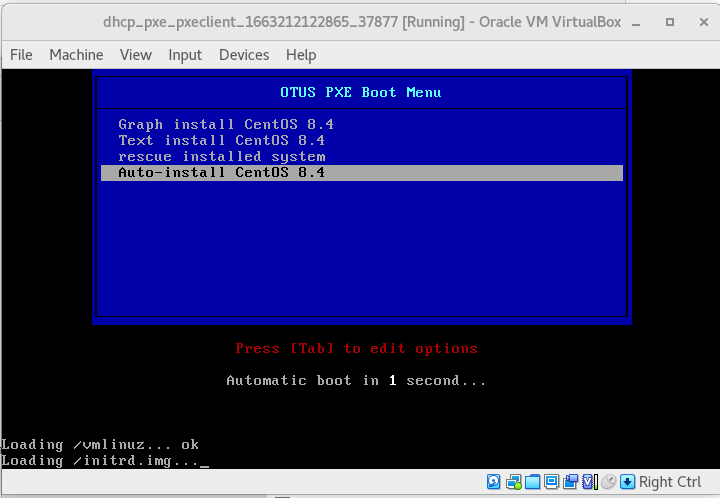

<h3>### DHCP, PXE ###</h3>

<h4>Описание домашнего задания</h4>

<ol>
<li>Следуя шагам из документа https://docs.centos.org/en-US/8-docs/advanced-install/assembly_preparing-for-a-network-install установить и настроить загрузку по сети для дистрибутива CentOS8. 
В качестве шаблона воспользуйтесь репозиторием https://github.com/nixuser/virtlab/tree/main/centos_pxe.</li>
<li>Поменять установку из репозитория NFS на установку из репозитория HTTP.</li>
<li>Настройить автоматическую установку для созданного kickstart файла (*) Файл загружается по HTTP.</li>
<li>* автоматизировать процесс установки Cobbler cледуя шагам из документа https://cobbler.github.io/quickstart/. 
Формат сдачи ДЗ - vagrant + ansible</li>
</ol>

<h4>1. Работа с шаблоном из задания</h4>

В домашней директории создадим директорию dhcp_pxe, в котором будут храниться настройки виртуальных машин:

<pre>[user@localhost otus]$ mkdir ./dhcp_pxe
[user@localhost otus]$</pre>

Перейдём в директорию backup:

<pre>[user@localhost otus]$ cd ./dhcp_pxe/
[user@localhost dhcp_pxe]$</pre>

Скачиваем файлы, указанные в домашнем задании: https://github.com/nixuser/virtlab/tree/main/centos_pxe. 
Рассмотрим загруженный Vagrantfile:

<pre>[user@localhost dhcp_pxe]$ vi ./Vagrantfile</pre>

<pre># -*- mode: ruby -*-
# vi: set ft=ruby :
# export VAGRANT_EXPERIMENTAL="disks"

Vagrant.configure("2") do |config|

config.vm.define "pxeserver" do |server|
  server.vm.box = 'centos/8.4'
  server.vm.disk :disk, size: "15GB", name: "extra_storage1"

  server.vm.host_name = 'pxeserver'
  server.vm.network :private_network, 
                     ip: "10.0.0.20", 
                     virtualbox__intnet: 'pxenet'

  # server.vm.network "forwarded_port", guest: 80, host: 8081

  server.vm.provider "virtualbox" do |vb|
    vb.memory = "1024"
    vb.customize ["modifyvm", :id, "--natdnshostresolver1", "on"]
  end

  # ENABLE to setup PXE
  server.vm.provision "shell",
    name: "Setup PXE server",
    path: "setup_pxe.sh"
  end

# config used from this
# https://github.com/eoli3n/vagrant-pxe/blob/master/client/Vagrantfile
  config.vm.define "pxeclient" do |pxeclient|
    pxeclient.vm.box = 'centos/8.4'
    pxeclient.vm.host_name = 'pxeclient'
    pxeclient.vm.network :private_network, ip: "10.0.0.21"
    pxeclient.vm.provider :virtualbox do |vb|
      vb.memory = "2048"
      vb.customize ["modifyvm", :id, "--natdnshostresolver1", "on"]
      vb.customize [
          'modifyvm', :id,
          '--nic1', 'intnet',
          '--intnet1', 'pxenet',
          '--nic2', 'nat',
          '--boot1', 'net',
          '--boot2', 'none',
          '--boot3', 'none',
          '--boot4', 'none'
        ]
    vb.customize ["modifyvm", :id, "--natdnshostresolver1", "on"]
    end
      # ENABLE to fix memory issues
#     end
  end

end</pre>

В некоторые строки требуется внести изменения:
● Pxeclient.vm.box = 'centos/8.4' и server.vm.box = 'centos/8.4' — на данный момент в Vagrant Box нет образа с таким именем. Нам требуется образ CentOS 8.4, воспользуемся образом bento/centos-8.4. Плюсом этого Vagrant Box является то, что по умолчанию он создаёт ОС с размером диска 60ГБ. При использовании данного образа нам не придётся полдключать дополнительный диск. 
● # export VAGRANT_EXPERIMENTAL="disks" и server.vm.disk :disk, size: "15GB", name: "extra_storage1" — так как нам хватает свободного места, мы можем не подключать дополнитеный диск. Если вы планируете в своём домашнем задании подключить дополнительный диск, то команда export VAGRANT_EXPERIMENTAL="disks" должна быть введена в терминале. 
● # server.vm.network "forwarded_port", guest: 80, host: 8081 — опция проброса порта. В нашем ДЗ мы её расскомментируем. Порт 8081 оставим таким же. 
● # ENABLE to setup PXE — блок настройки PXE-сервера с помощью bash-скрипта. Так как мы будем использовать Ansible для настройки хоста, данный блок нам не понадобится, поэтому мы его закомментируем. Далее можно будет добавить блок настройки хоста с помощью Ansible… 
● Для настройки хоста через Ansible, нам потребуется добавить дополнтельный сетевой интефейс для Pxeserver. Добавим дополнительный сетевой интефейс с адресом 192.168.50.10:

<pre>server.vm.network :private_network, ip: "192.168.50.10", adapter: 3.</pre>

Vagrantfile теперь выглядит следующим обазом:

<pre># -*- mode: ruby -*-
# vi: set ft=ruby :
# export VAGRANT_EXPERIMENTAL="disks"

Vagrant.configure("2") do |config|

config.vm.define "pxeserver" do |server|
  server.vm.box = 'bento/centos-8.4'
  server.vm.disk :disk, size: "15GB", name: "extra_storage1"

  server.vm.host_name = 'pxeserver'
  server.vm.network :private_network, 
                     ip: "10.0.0.20", 
                     virtualbox__intnet: 'pxenet'
  server.vm.network :private_network, ip: "192.168.50.10", adapter: 3

  # server.vm.network "forwarded_port", guest: 80, host: 8081

  server.vm.provider "virtualbox" do |vb|
    vb.memory = "1024"
    vb.customize ["modifyvm", :id, "--natdnshostresolver1", "on"]
  end

  # ENABLE to setup PXE
#  server.vm.provision "shell",
#    name: "Setup PXE server",
#    path: "setup_pxe.sh"
#  end

# config used from this
# https://github.com/eoli3n/vagrant-pxe/blob/master/client/Vagrantfile
  config.vm.define "pxeclient" do |pxeclient|
    pxeclient.vm.box = 'bento/centos-8.4'
    pxeclient.vm.host_name = 'pxeclient'
    pxeclient.vm.network :private_network, ip: "10.0.0.21"
    pxeclient.vm.provider :virtualbox do |vb|
      vb.memory = "2048"
      vb.customize ["modifyvm", :id, "--natdnshostresolver1", "on"]
      vb.customize [
          'modifyvm', :id,
          '--nic1', 'intnet',
          '--intnet1', 'pxenet',
          '--nic2', 'nat',
          '--boot1', 'net',
          '--boot2', 'none',
          '--boot3', 'none',
          '--boot4', 'none'
        ]
    vb.customize ["modifyvm", :id, "--natdnshostresolver1", "on"]
    end
      # ENABLE to fix memory issues
#     end
  end

end</pre>

После внесения всех изменений запускаем наш стенд с помощью команды vagrant up:

<pre>[user@localhost dhcp_pxe]$ vagrant up</pre>

Данный Vagrantfile развернет нам 2 хоста: pxeserver и pxeclient:

<pre>[user@localhost dhcp_pxe]$ vagrant status
Current machine states:

pxeserver                 running (virtualbox)
pxeclient                 running (virtualbox)

This environment represents multiple VMs. The VMs are all listed
above with their current state. For more information about a specific
VM, run `vagrant status NAME`.
[user@localhost netarchitecture]$</pre>

Выполнение команды закончится с ошибкой, так как на Pxeclient настроена загрузка по сети.

Теперь мы приступаем к настройке PXE-сервера. 
Для настроки хоста с помощью Ansible создадим необходимые файлы и структуру директорий в отдельной папке ansible:

<pre>[user@localhost dhcp_pxe]$ mkdir ./ansible && cd ./ansible
[user@localhost ansible]$</pre>

Создадим конфигурационный файл ansible.cfg, который описывает базовые настройки
для работы Ansible:

<pre>[user@localhost dhcp_pxe]$ vi ./ansible.cfg</pre>

<pre>[defaults]
#Отключение проверки ключа хоста
host_key_checking = false
#Указываем имя файла инвентаризации
inventory = hosts
#Отключаем игнорирование предупреждений
command_warnings= false</pre>

Создадим файл инвентаризации hosts, который хранит информацию о том, как
подключиться к хосту:

<pre>[user@localhost dhcp_pxe]$ vi ./hosts</pre>

<pre>[servers]
pxeserver ansible_host=192.168.50.10 ansible_user=vagrant
ansible_ssh_private_key_file=.vagrant/machines/inetRouter/virtualbox/pri
vate_key</pre>

где: 
● [servers] - в квадратных скобках указана группа хостов 
● pxeserver — имя нашего хоста (имена хостов и групп не могут быть одинаковые) 
● ansible_host — адрес нашего хоста 
● ansible_user — имя пользователя, с помощью которого Ansible будет подключаться к хосту 
● ansible_ssh_private_key — адрес расположения ssh-ключа

Создадим файл playbook.yml — основной файл, в котором содержатся инструкции (модули) по настройке для Ansible:

<pre>[user@localhost dhcp_pxe]$ vi ./playbook.yml</pre>

<pre>---
- name: CentOS_PXE | Install and Configure
  hosts: all
  become: true

  roles:
    - { role: dhcp_pxe, when: ansible_system == 'Linux' }</pre>

Создадим директорий roles и структуру директорий dhcp_pxe:

<pre>[user@localhost ansible]$ mkdir ./roles && cd ./roles
[user@localhost roles]$ ansible-galaxy init dhcp_pxe
- Role dhcp_pxe was created successfully
[user@localhost roles]$</pre>

<h4>Настройка Web-сервера</h4>

Для того, чтобы отдавать файлы по HTTP нам потребуется настроенный веб-сервер.

Процесс настройки вручную: 
0. Так как у CentOS 8 закончилась поддержка, для установки пакетов нам потребуется поменять репозиторий. Сделать это можно с помощью сдедуюущих команд:

<pre>sed -i 's/mirrorlist/#mirrorlist/g' /etc/yum.repos.d/CentOS-Linux-*
sed -i 's|#baseurl=http://mirror.centos.org|baseurl=http://vault.centos.org|g' /etc/yum.repos.d/CentOS-Linux-*</pre>

1. Устанавливаем Web-сервер Apache:

<pre>yum install httpd</pre>

2. Далее скачиваем образ CentOS 8.4.2150:

<pre>wget https://mirror.sale-dedic.com/centos/8.4.2105/isos/x86_64/CentOS-8.4.2105-x86_64-dvd1.iso</pre>

Размер образа больше 9ГБ, скачивание может занять продолжительное время.

3. Монтируем данный образ:

<pre>mount -t iso9660 CentOS-8.4.2105-x86_64-dvd1.iso /mnt -o loop,ro</pre>

4. Создаём каталог /iso и копируем в него содержимое данного каталога:

<pre>mkdir /iso
cp -r /mnt/* /iso</pre>

5. Ставим права 755 на каталог /iso: 

<pre>chmod -R 755 /iso</pre>

6. Настраиваем доступ по HTTP для файлов из каталога /iso: 
● Создаем конфигурационный файл:

<pre>vi /etc/httpd/conf.d/pxeboot.conf</pre>

● Добавляем следующее содержимое в файл:

<pre>Alias /centos8 /iso
#Указываем адрес директории /iso
&lt;Directory /iso&gt;
    Options Indexes FollowSymLinks
    #Разрешаем подключения со всех ip-адресов
    Require all granted</pre>

● Перезапускаем веб-сервер:

<pre>systemctl restart httpd</pre>

● Добавляем его в автозагрузку:

<pre>systemctl enable httpd</pre>

7. Проверяем, что веб-сервер работает и каталог /iso доступен по сети: 
● С нашего компьютера сначала подключаемся к тестовой странице Apache:

Если страница открылась, значит веб-сервер запустился.

● Далее проверям доступность файлов по сети:

Если файлы доступны, значит веб-сервер настроен корректно.

<h4>Настройки Веб-сервера в Ansible</h4>

Как запланировано, все выше указанные настройки будем выполнять с помощью ansible:

<pre>vi ./playbook.yml</pre>

<pre>---
- name: CentOS_PXE | Set up PXE Server
  #Указываем имя хоста или группу, которые будем настраивать
  hosts: pxeserver
  #Параметр выполнения модулей от root-пользователя
  become: true

  roles:
    - { role: dhcp_pxe, when: ansible_system == 'Linux' }
</pre>

<pre>vi ./roles/dhcp_pxe/tasks/main.yml</pre>

<pre>---
# tasks file for dhcp_pxe

- include_tasks: web.yml

- include_tasks: tftp.yml

- include_tasks: dhcp.yml

- include_tasks: ks.yml</pre>

<pre>vi ./roles/dhcp_pxe/tasks/web.yml</pre>

<pre>---
# tasks file for dhcp_pxe

#sed -i 's/mirrorlist/#mirrorlist/g' /etc/yum.repos.d/CentOS-Linux-*
- name: set up repo
  replace:
    path: "{{ item }}"
    regexp: 'mirrorlist'
    replace: '#mirrorlist'
  loop:
  - /etc/yum.repos.d/CentOS-Linux-AppStream.repo
  - /etc/yum.repos.d/CentOS-Linux-BaseOS.repo

#sed -i 's|#baseurl=http://mirror.centos.org|baseurl=http://vault.centos.org|g' /etc/yum.repos.d/CentOS-Linux-*
- name: set up repo
  replace:
    path: "{{ item }}"
    regexp: '#baseurl=http://mirror.centos.org'
    replace: 'baseurl=http://vault.centos.org'
  loop:
  - /etc/yum.repos.d/CentOS-Linux-AppStream.repo
  - /etc/yum.repos.d/CentOS-Linux-BaseOS.repo

#Установка пакета httpd (дополнительно сразу ставятся все пакеты, которые потребуются в данном задании)
- name: install softs on CentOS
  yum:
    name:
    - vim
    - wget
    - epel-release
    - httpd
    - tftp-server
    - dhcp-server
    state: present
    update_cache: true

#Скачивание образа CentOS-8.4.2105-x86_64-dvd1.iso
#Скачиваться будет долго, размер файла больше 9 ГБ.
- name: Download ISO image CentOS 8.4.2105
  get_url:
    url: http://mirror.sale-dedic.com/centos/8.4.2105/isos/x86_64/CentOS-8.4.2105-x86_64-dvd1.iso
    dest: ~/CentOS-8.4.2105-x86_64-dvd1.iso
    mode: '0755'

#Создание каталога /iso и назначение прав 755
- name: Create ISO directory
  file:
    path: /iso
    state: directory
    mode: '0755'

#Монтируем образ в каталог /mnt
- name: Mount ISO image
  mount:
    path: /mnt
    src: /root/CentOS-8.4.2105-x86_64-dvd1.iso
    fstype: iso9660
    opts: ro,loop
    state: mounted

#Копируем все файлы из каталога /mnt в /iso
- name: copy ALL files from /mnt to /iso
  copy:
    src: /mnt/
    dest: /iso
    remote_src: yes
    directory_mode: yes

#Копируем конфгурационный файл pxeboot.conf (Файл должен быть предварительно создан в каталаге templates)
- name: set up httpd config
  copy:
    src: pxeboot.conf
    dest: /etc/httpd/conf.d/pxeboot.conf
    owner: root
    group: root
    mode: 0640
  notify: 
  - restart httpd</pre>

<pre>vi ./roles/dhcp_pxe/handlers/main.yml</pre>

<pre>---
# handlers file for dhcp_pxe

#Перезупускаем httpd и добавляем службу в автозагрузку
- name: restart httpd
  service:
    name: httpd
    state: restarted
    enabled: true</pre>

На этом настройка веб-сервера завершена.

<h4>Настройка TFTP-сервера</h4>

1. Устанавлием tftp-сервер: 

<pre>yum install tftp-server</pre>

2. Запускаем службу:

<pre>systemctl start tftp.service</pre>

3. Проверяем, в каком каталоге будут храиться файлы, которые будет отдавать TFTP-сервер:

<pre>[root@pxeserver ~]# systemctl status tftp.service
● tftp.service - Tftp Server
   Loaded: loaded (/usr/lib/systemd/system/tftp.service; indirect; vendor preset: disabled)
   Active: active (running) since Wed 2022-09-14 21:29:30 UTC; 1min 37s ago
     Docs: man:in.tftpd
 Main PID: 11522 (in.tftpd)
    Tasks: 1 (limit: 4953)
   Memory: 240.0K
   CGroup: /system.slice/tftp.service
           └─11522 /usr/sbin/in.tftpd -s /var/lib/tftpboot

Sep 14 21:29:30 pxeserver systemd[1]: Started Tftp Server.
[root@pxeserver ~]#</pre>

В статусе видим, что рабочий каталог /var/lib/tftpboot.

4. Созаём каталог, в котором будем хранить наше меню загрузки:

<pre>mkdir /var/lib/tftpboot/pxelinux.cfg</pre>

5. Создаём меню-файл:

<pre>vi /var/lib/tftpboot/pxelinux.cfg/default</pre>

<pre>default menu.c32
prompt 0
#Время счётчика с обратным отсчётом (установлено 15 секунд)
timeout 150
#Параметр использования локального времени
ONTIME local
#Имя «шапки» нашего меню
menu title OTUS PXE Boot Menu
       #Описание первой строки
       label 1
       #Имя, отображаемое в первой строке
       menu label ^ Graph install CentOS 8.4
       #Адрес ядра, расположенного на TFTP-сервере
       kernel /vmlinuz
       #Адрес файла initrd, расположенного на TFTP-сервере
       initrd /initrd.img
       #Получаем адрес по DHCP и указываем адрес веб-сервера
       append ip=enp0s3:dhcp inst.repo=http://10.0.0.20/centos8
       label 2
       menu label ^ Text install CentOS 8.4
       kernel /vmlinuz
       initrd /initrd.img
       append ip=enp0s3:dhcp inst.repo=http://10.0.0.20/centos8 text
       label 3
       menu label ^ rescue installed system
       kernel /vmlinuz
       initrd /initrd.img
       append ip=enp0s3:dhcp inst.repo=http://10.0.0.20/centos8 rescue</pre>

Label 1-3 различаются только дополнительными параметрами: 
● label 1 — установка вручную в графическом режиме 
● label 2 — установка вручную в текстовом режиме 
● label 3 — восстановление системы

6. Распакуем файл syslinux-tftpboot-6.04-5.el8.noarch.rpm:

<pre>rpm2cpio /iso/BaseOS/Packages/syslinux-tftpboot-6.04-5.el8.noarch.rpm | cpio -dimv</pre>

7. После распаковки в каталоге пользователя root будет создан каталог tftpboot из которого потребуется скопировать следующие файлы:

- pxelinux.0 
- ldlinux.c32 
- libmenu.c32 
- libutil.c32 
- menu.c32 
- vesamenu.c32

<pre>cd tftpboot
cp pxelinux.0 ldlinux.c32 libmenu.c32 libutil.c32 menu.c32 vesamenu.c32 /var/lib/tftpboot/</pre>

8. Также в каталог /var/lib/tftpboot/ нам потребуется скопировать файлы initrd.img и vmlinuz, которые располагаются в каталоге /iso/images/pxeboot/:

<pre>cp /iso/images/pxeboot/{initrd.img,vmlinuz} /var/lib/tftpboot/</pre>

9. Далее перезапускаем TFTP-сервер и добавляем его в автозагрузку:

<pre>systemctl restart tftp.service
systemctl enable tftp.service</pre>

<h4>Настройка TFTP-сервера в Ansible:</h4>

<pre>vi ./roles/dhcp_pxe/main/tftp.yml</pre>

<pre>---
# tasks file for dhcp_pxe

#Создаём каталог /var/lib/tftpboot/pxelinux.cfg
- name: Create TFTP directory
  file:
    path: /var/lib/tftpboot/pxelinux.cfg
    state: directory
    mode: '0755'

#Копируем файл-меню на сервер
- name: set up pxelinux
  template:
    src: default
    dest: /var/lib/tftpboot/pxelinux.cfg/default
    owner: root
    group: root
    mode: 0644

#Извлекаем файлы из RPM-пакета
- name: extract packages syslinux
  shell: rpm2cpio /iso/BaseOS/Packages/syslinux-tftpboot-6.04-5.el8.noarch.rpm | cpio -dimv

#Копируем файлы в каталог /var/lib/tftpboot/
- name: copy files to TFTP share
  copy:
    src: /home/vagrant/tftpboot/{{ item }}
    dest: /var/lib/tftpboot/{{ item }}
    mode: '0644'
    remote_src: true
  loop:
  - pxelinux.0
  - ldlinux.c32
  - libmenu.c32
  - libutil.c32
  - menu.c32
  - vesamenu.c32

#Копируем файлы в каталог /var/lib/tftpboot/
- name: copy initrd and vmlinuz files to TFTP share
  copy:
    src: /iso/images/pxeboot/{{ item }}
    dest: /var/lib/tftpboot/{{ item }}
    mode: '0755'
    remote_src: true
  loop:
  - initrd.img
  - vmlinuz
  notify: 
  - restart tftp-server</pre>

В файл ./roles/dhcp_pxe/handlers/main.yml добавим следующие строки:

<pre>#Перезапускаем TFTP-сервер и добавляем его в автозагрузку
- name: restart tftp-server
  service:
    name: tftp.service
    state: restarted
    enabled: true</pre>

<h4>Настройка DHCP-сервера</h4>

1. Устанавливаем DHCP-сервер: 

<pre>yum install dhcp-server</pre>

2. Правим конфигурационный файл: 

<pre>vi /etc/dhcp/dhcpd.conf</pre>

<pre>option space pxelinux;
option pxelinux.magic code 208 = string;
option pxelinux.configfile code 209 = text;
option pxelinux.pathprefix code 210 = text;
option pxelinux.reboottime code 211 = unsigned integer 32;
option architecture-type code 93 = unsigned integer 16;

#Указываем сеть и маску подсети, в которой будет работать DHCP-сервер
subnet 10.0.0.0 netmask 255.255.255.0 {
        #Указываем шлюз по умолчанию, если потребуется
        #option routers 10.0.0.1;
        #Указываем диапазон адресов
        range 10.0.0.100 10.0.0.120;
		
        class "pxeclients" {
          match if substring (option vendor-class-identifier, 0, 9) = "PXEClient";
          #Указываем адрес TFTP-сервера
          next-server 10.0.0.20;
          #Указываем имя файла, который надо запустить с TFTP-сервера
          filename "pxelinux.0";
        }</pre>

<h4>Настройка DHCP-сервера в Ansible:</h4>

<pre>vi ./roles/dhcp_pxe/main/dhcp.yml</pre>

<pre>---
# tasks file for dhcp_pxe

#Копирование файла конфигурации DHCP-сервера
- name: set up dhcp-server
  template:
    src: dhcpd.conf.j2
    dest: /etc/dhcp/dhcpd.conf
    mode: '0644'
  notify: 
  - restart dhcp-server</pre>

В файл ./roles/dhcp_pxe/handlers/main.yml добавим следующие строки:

<pre>#Перезапуск службы и добавление в автозагрузку
- name: restart dhcp-server
  service:
    name: dhcpd
    state: restarted
    enabled: true</pre>

Файл ./roles/dhcp_pxe/handlers/main.yml в целом выглядит следующим образом:

<pre>vi ./roles/dhcp_pxe/handlers/main.yml</pre>

<pre>---
# handlers file for dhcp_pxe

#Перезупускаем httpd и добавляем службу в автозагрузку
- name: restart httpd
  service:
    name: httpd
    state: restarted
    enabled: true

#Перезапускаем TFTP-сервер и добавляем его в автозагрузку
- name: restart tftp-server
  service:
    name: tftp.service
    state: restarted
    enabled: true

#Перезапуск службы и добавление в автозагрузку
- name: restart dhcp-server
  service:
    name: dhcpd
    state: restarted
    enabled: true</pre>

При копировании файла конфигурации можно использовать Jinja2 Template, который будет обращаться к переменным из файла defaults/main.yml.

Файл dhcpd.conf.j2:

<pre>option space pxelinux;
option pxelinux.magic code 208 = string;
option pxelinux.configfile code 209 = text;
option pxelinux.pathprefix code 210 = text;
option pxelinux.reboottime code 211 = unsigned integer 32;
option architecture-type code 93 = unsigned integer 16;

subnet {{ dhcp_network }} netmask {{ dhcp_mask }} {
    range {{ dhcp_range_min }} {{ dhcp_range_max }};
		 
    class "pxeclients" {
        match if substring (option vendor-class-identifier, 0, 9) = "PXEClient";
        next-server {{ pxe_server }};
        filename "pxelinux.0";
    }
}</pre>

Переменные, которые заключены в двойные скобки будут описаны в файле defaults/main.yml.

На данном этапе мы закончили настройку PXE-сервера для ручной установки сервера. Давайте попробуем запустить процесс установки вручную, для удобства воспользуемся установкой через графический интерфейс: 
В настройках виртуальной машины pxeclient рекомендуется поменять графический контроллер на VMSVGA и добавить видеопамяти. Видеопамять должна стать 20 МБ или больше.

С такими настройками картинка будет более плавная и не будет постоянно мигать. 
Нажимаем ОК, выходим из настроек ВМ и запускаем её. 

Выбираем графическую установку. 
После этого, будут скачаны необходимые файлы с веб-сервера. 
Как только появится окно установки, нам нужно будет поочереди пройти по всем компонентам и указать с какими параметрами мы хотим установить ОС: 

Иногда с разделом Installation Source случаются проблемы, и репозиторий не подтягивается автоматически. В этом случае нужно руками указать адрес репозитория: http://10.0.0.20/centos8/BaseOS

После установки всех, нужных нам параметров нажимаем Begin installation.

После этого начнётся установка системы, после установки всех компонентов нужно будет перезагрузить ВМ и запуститься с диска.

Если нам не хочется вручную настраивать каждую установку, то мы можем автоматизировать этот процесс с помощью файла автоматиеской установки (kickstart file)

<h4>Настройка автоматической установки с помощью Kickstart-файла</h4>

1. Создаем kickstart-файл и кладём его в каталог к веб-серверу:

<pre>vi /iso/ks.cfg</pre>

<pre>#version=RHEL8
#Использование в установке только диска /dev/sda
ignoredisk --only-use=sda
autopart --type=lvm
#Очистка информации о партициях
clearpart --all --initlabel --drives=sda
#Использование графической установки
graphical
#Установка английской раскладки клавиатуры
keyboard --vckeymap=us --xlayouts='us'
#Установка языка системы
lang en_US.UTF-8
#Добавление репозитория
url —url=http://10.0.0.20/centos8/BaseOS/
#Сетевые настройки
network --bootproto=dhcp --device=enp0s3 --ipv6=auto --activate
network --bootproto=dhcp --device=enp0s8 --onboot=off --ipv6=auto --activate
network --hostname=otus-pxe-client
#Устанвка пароля root-пользователю (Указан SHA-512 hash пароля 123)
rootpw --iscrypted
$6$sJgo6Hg5zXBwkkI8$btrEoWAb5FxKhajagWR49XM4EAOfO/Dr5bMrLOkGe3KkMYdsh7T3MU5mYwY
2TIMJpVKckAwnZFs2ltUJ1abOZ.
firstboot --enable
#Не настраиваем X Window System
skipx
#Настраиваем системные службы
services --enabled="chronyd"
#Указываем часовой пояс
timezone Europe/Moscow --isUtc
user --groups=wheel --name=val
--password=$6$ihX1bMEoO3TxaCiL$OBDSCuY.EpqPmkFmMPVvI3JZlCVRfC4Nw6oUoPG0RGuq2g5B
jQBKNboPjM44.0lJGBc7OdWlL17B3qzgHX2v// --iscrypted --gecos="val"

%packages
@^minimal-environment
kexec-tools

%end

%addon com_redhat_kdump --enable --reserve-mb='auto'

%end

%anaconda
pwpolicy root --minlen=6 --minquality=1 --notstrict --nochanges --notempty
pwpolicy user --minlen=6 --minquality=1 --notstrict --nochanges --emptyok
pwpolicy luks --minlen=6 --minquality=1 --notstrict --nochanges --notempty
%end</pre>

2. Добавляем параметр в меню загрузки:

<pre>vi /var/lib/tftpboot/pxelinux.cfg/default</pre>

<pre>default menu.c32
prompt 0
timeout 150
ONTIME local
menu title OTUS PXE Boot Menu
       label 1
       menu label ^ Graph install CentOS 8.4
       kernel /vmlinuz
       initrd /initrd.img
       append ip=enp0s3:dhcp inst.repo=http://10.0.0.20/centos8
       label 2
       menu label ^ Text install CentOS 8.4
       kernel /vmlinuz
       initrd /initrd.img
       append ip=enp0s3:dhcp inst.repo=http://10.0.0.20/centos8 text
       label 3
       menu label ^ rescue installed system
       kernel /vmlinuz
       initrd /initrd.img
       append ip=enp0s3:dhcp inst.repo=http://10.0.0.20/centos8 rescue
       label 4
       menu label ^ Auto-install CentOS 8.4
       #Загрузка данного варианта по умолчанию
       menu default
       kernel /vmlinuz
       initrd /initrd.img
       append ip=enp0s3:dhcp inst.ks=http://10.0.0.20/centos8/ks.cfg
inst.repo=http://10.0.0.20/centos8/</pre>

В append появляется дополнительный параметр inst.ks, в котором указан адрес
kickstart-файла.

Если вы хотите сгенерировать хэш другого пароля, то сделать это можно с
помощью команды:

<pre>python3 -c 'import crypt,getpass; print(crypt.crypt(getpass.getpass(), crypt.mksalt(crypt.METHOD_SHA512)))'</pre>

<h4>Отправка kickstart-файла с помощью Ansible</h4>

<pre>vi ./roles/dhcp_pxe/tasks/ks.yml</pre>

<pre>- name: copy ks.cfg
  template:
    src: ks.cfg
    dest: /iso/ks.cfg
    owner: root
    group: root
    mode: 0755</pre>

Для запуска Ansible сразу из Vagrant нужно добавим следующий код в описание ВМ pxeserver:

<pre>server.vm.provision "ansible" do |ansible|
  ansible.playbook = "ansible/playbook.yml"
  ansible.inventory_path = "ansible/hosts"
  ansible.host_key_checking = "false"
  ansible.limit = "all"
end</pre>

После внесения данных изменений, можем перезапускаем нашу ВМ pxeclient и проверить, что запустится процесс автоматической установки ОС:

